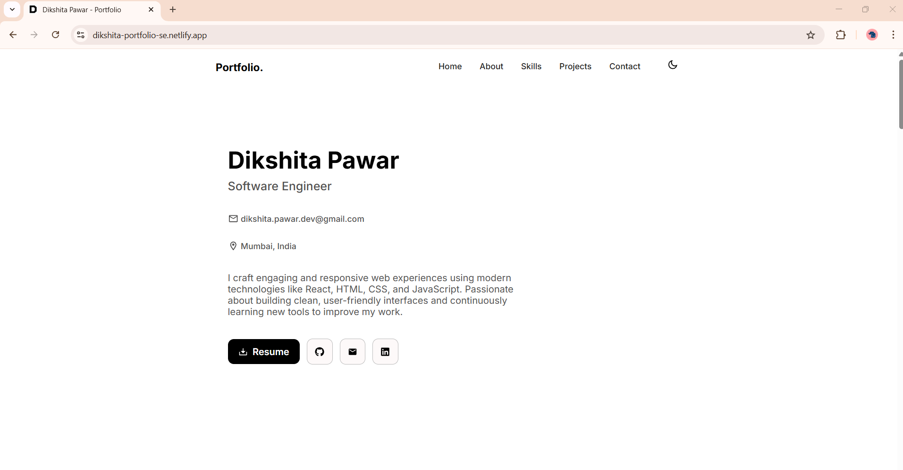
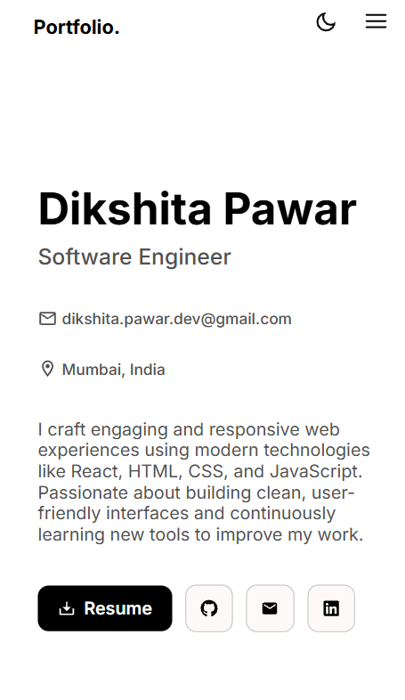
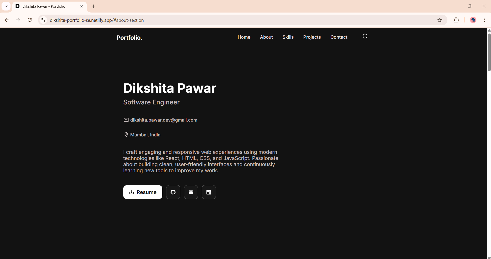
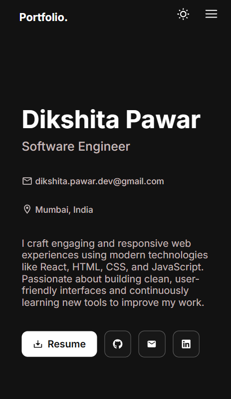

# React Portfolio

A modern and responsive portfolio website built using **React.js** to showcase my projects, skills, and experience as a web developer.

## Live Demo

Check out the live website here: [Visit My Portfolio](https://dikshita-portfolio-se.netlify.app/)

## Tech Stack

- **React.js** – Frontend framework
- **React Router** – Page routing
- **CSS3** – Styling

## Features

- Responsive layout for desktop and mobile
- Hamburger menu for mobile navigation 
- Smooth scroll navigation
- Project showcase with images and links
- Downloadable resume
- Dark/light mode

## 📸 Screenshots

| Desktop View | Mobile View |
|--------------|-------------|
|  |  |
|  |  |

## 👩‍💻 Developer

**Dikshita Pawar**  
🐙 GitHub - [dikshita168](https://github.com/dikshita168)  
📧 Email: dikshita.pawar.dev@gmail.com  

If you'd like to connect, feel free to reach out!

